Parts Implemented by Ceyda ALADAĞ
================================
First of all, Unicorn website is opened via the localhost:5000 or bluemix. To begin the database of Profiles itucsdb1601.mybluemix.net/initdb is written on the address bar.

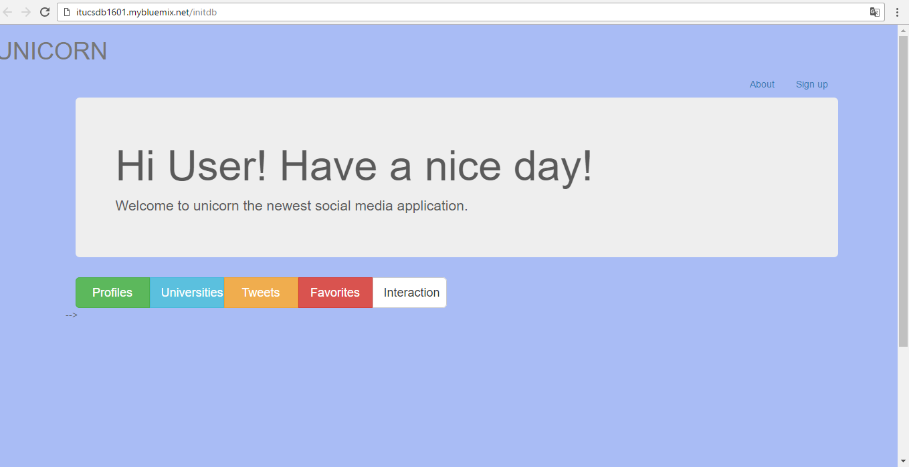
 
Fig. 1. Initializing the database

After that, person who wants to use this website logs in the Unicorn website by using this sign up page. Users enter the name, surname, user name, e-mail address, password and select their gender and sign in the website. 

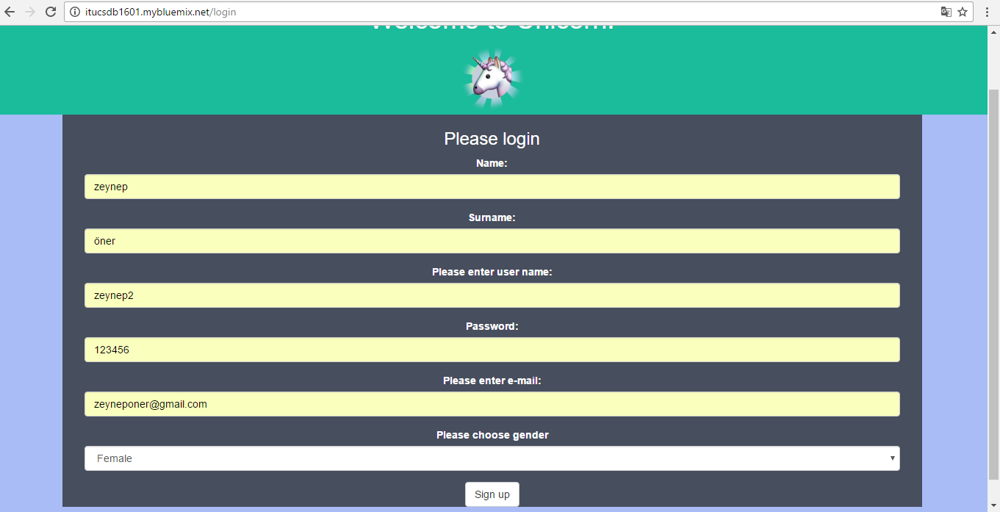
 
Fig. 2 Sign Up page

Users selecting profile information are seen in the profile page on this selection table. 

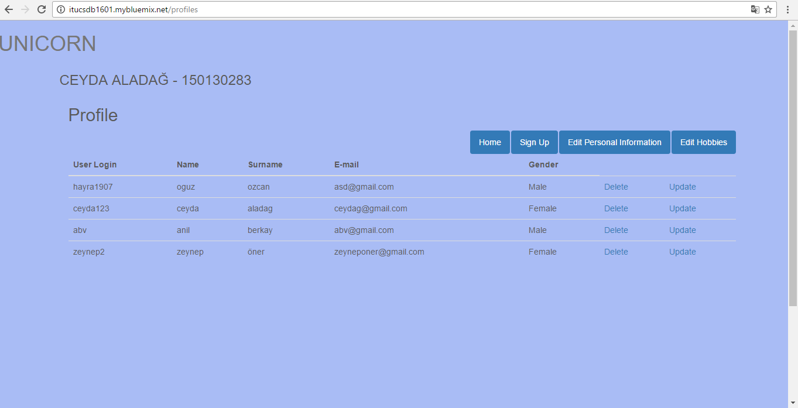
 
Fig. 3 Profiles List

If the admins wants to update the user name of person, update button is clicked and new user name is entered by admin. 

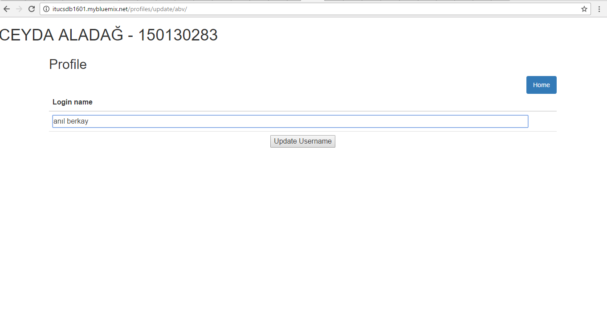
 
Fig. 4 Update operation on user name

After this operation is done, user name of person is changed and this change can be seen on the selection table.

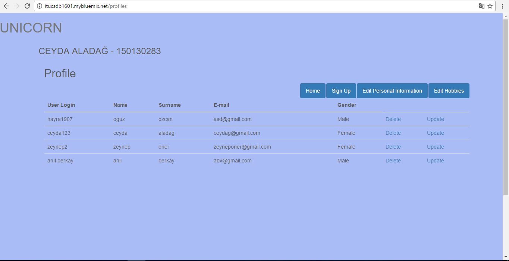
 
Fig. 5 Profile List after the Update operation

If the admin wants to delete one or more person from the database, delete button is clicked and person and their information is deleted from the user_login table and website database.

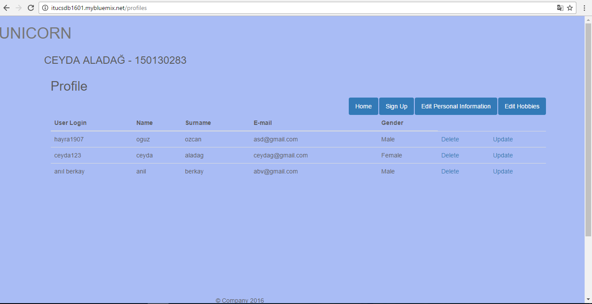
 
Fig. 6 Profile List after the Delete operation

In the profile page, there is an Edit Personal Information button. When is clicked this button, personal information page is opened. This page provides the observing the personal information of users for admins.
If admins wants the inserting personal information for users which is registered with sign up and existing in website database this part is used.  Firstly, user name is entered. Then, nationality and country is selected from the dropdowns which are the static table in database. Living city and telephone number is written. Finally, date of birth is selected from the calender and clicked the insert-update button. Thus, personal information for user with his/her user name is added.

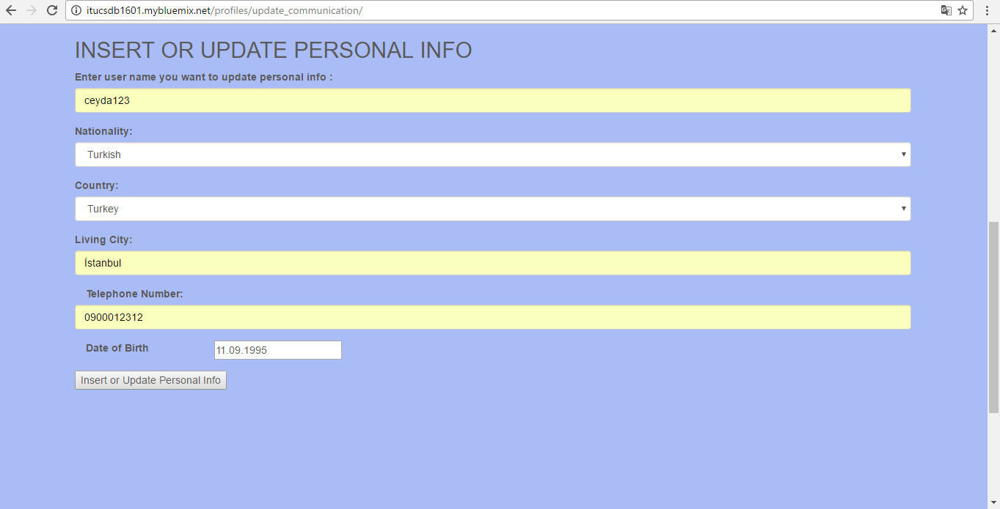
   
Fig. 7 Insert operation for Personal Info List

	If non existing information about the one user name, then insert operation is made realized. However, ıf the existing information about the one user name, then update operation is done with the new entering personal information. 
	
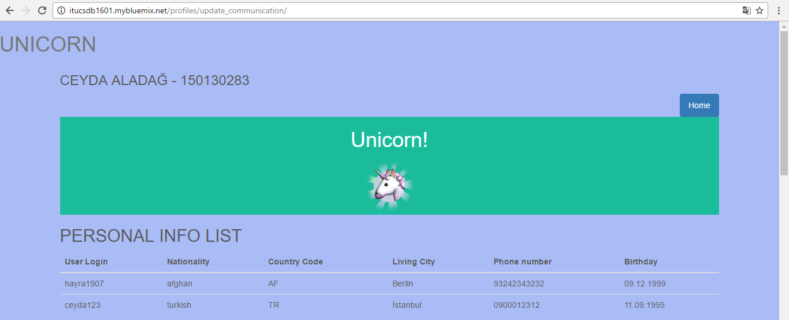
 
Fig. 8 Personal Info List after the Insert operation

Added and updated personal information can be seen on the selection table in top of the page. This table shows the country code for selecting country since the join operation is made realized between country and user_communication table. 

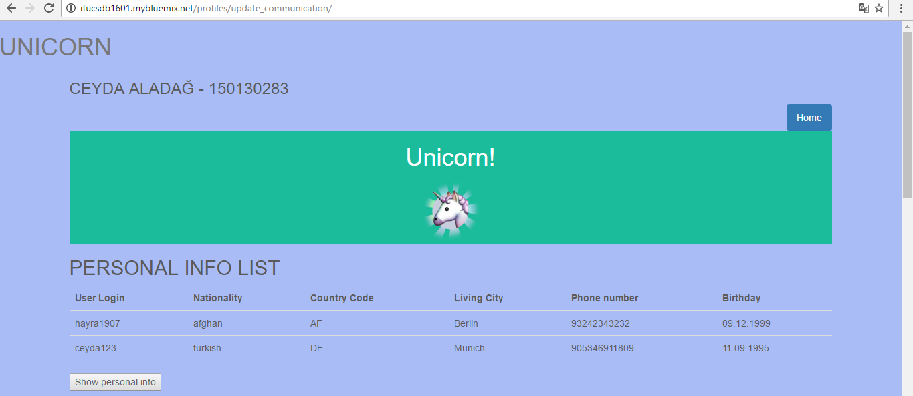
   
Fig. 9 Personal Info List after the Update operation

If the entered user name is not exist in database, when clicked the button, "There is no user with that user name " warning message is seen on the another page. 

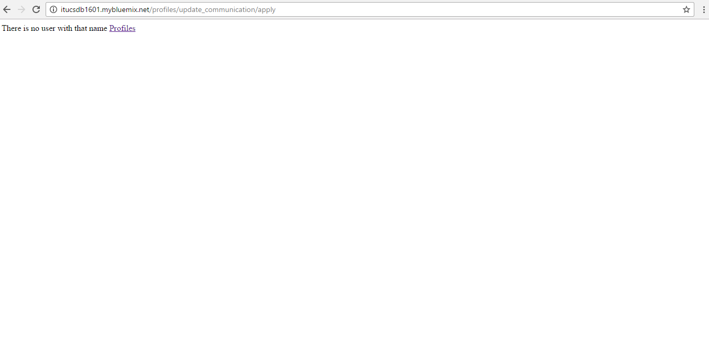
   
Fig. 10 Warning Message Page

To delete the personal information from the personal info list and database, the user name to be deleted is written. When the clicked the delete button, person is deleted from the database and can not be seen on the personal info list.

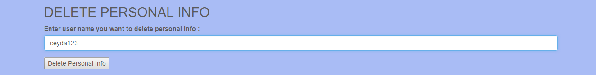
   
Fig. 11 Delete operation for Personal Info

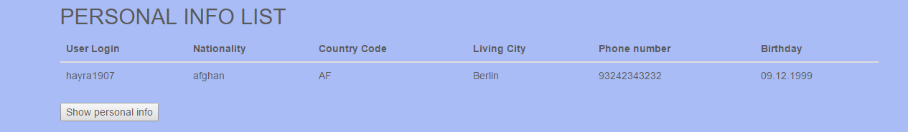
   
Fig. 12 Personal Info List after the Delete operation

Edit Hobbies button is also in the top of the profile page. If is clicked this button, hobby page is opened. To insert the hobby for user, user name is entered in the text box and hobby is selected from the dropdown which is static table in database. When the insert and update button is pressed, person hobby is added to a hobby list and Unicorn database. 

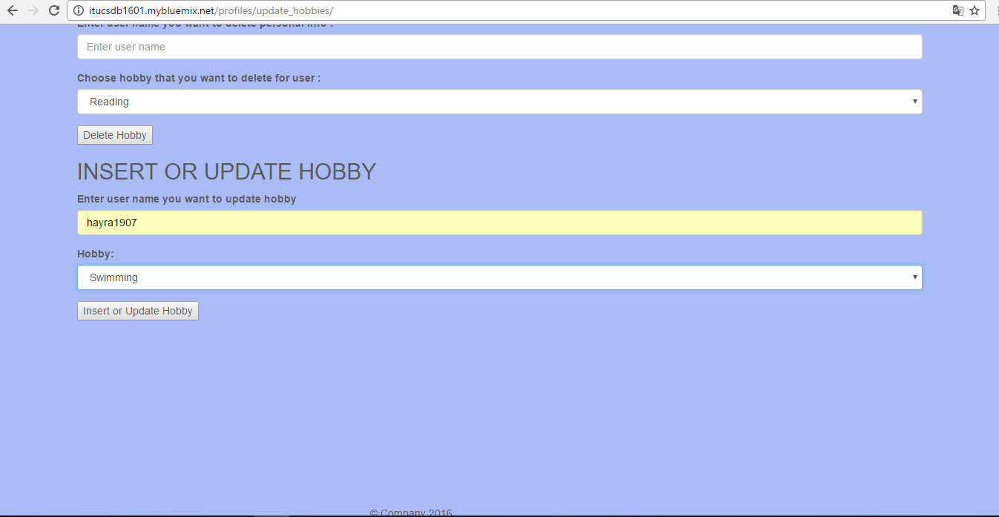
   
 Fig. 13 Insert operation for Hobbies

Inserted and updated hobbies for user names can be seen on the hobby list table. One person can have an one or more hobbies for herself/himself. Hobby types are also seen since the join operation between hobbies and user_hobbies.

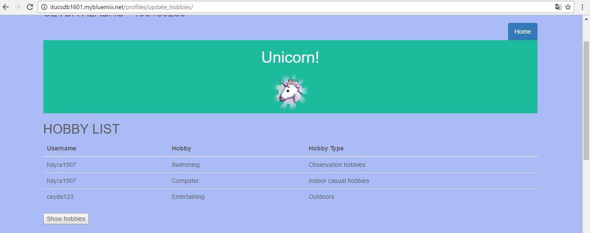
   
Fig. 14 Hobby List after the insert and update operation

To delete the hobby from the hobby list and database, user name and hobby name is written. Then, delete operation is done by using the delete hobbies button. 

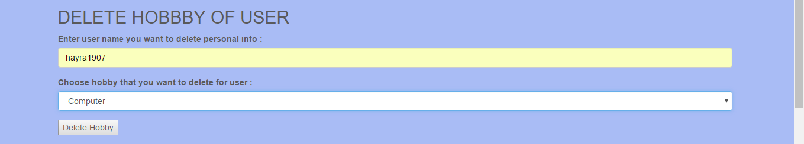
   
Fig.15 Delete operation for Hobbies

After the delete operation, hobbies and user names are seen on the hobby list. 

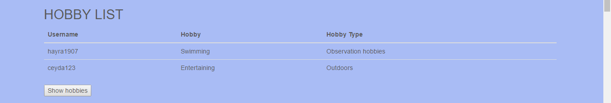
   
Fig. 16 Hobby list after delete operation

If the non existing user name is entered or wrong hobby is selected, warnin mesaage is came and user name and hobby can not be deleted from the hobby list and database.

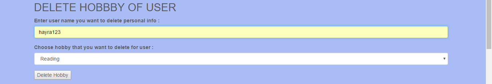
   
Fig. 17 Wrong Delete operation

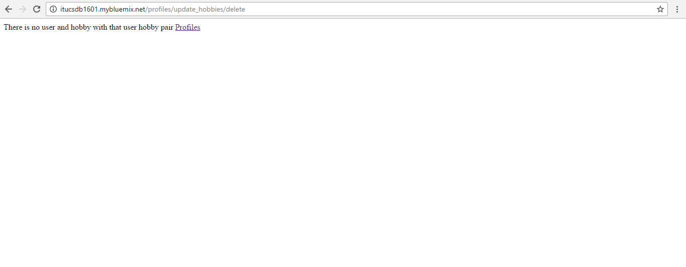
   
   
 Fig. 18 Warning message for the Delete operation       

