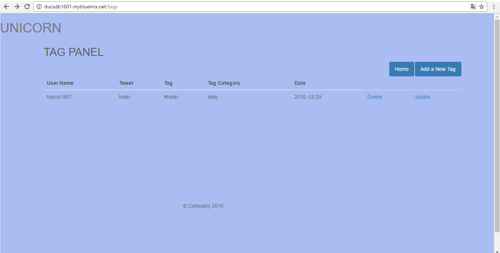
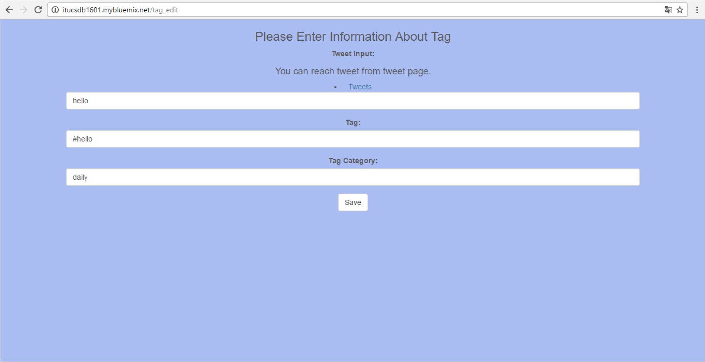
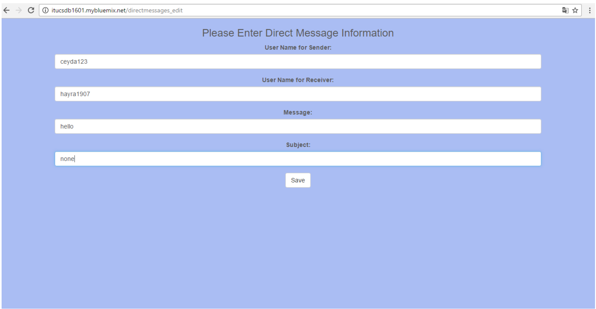
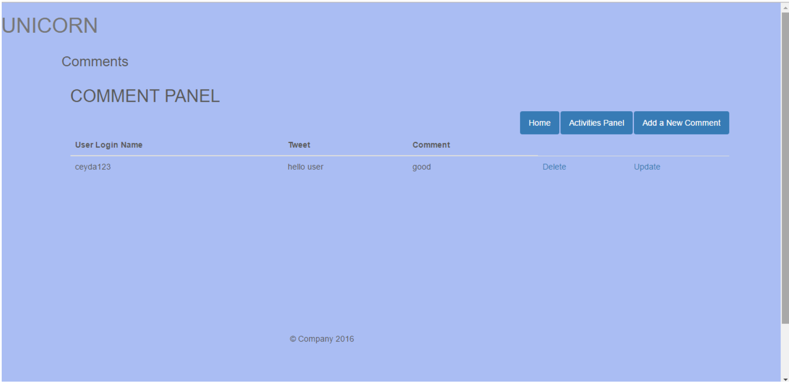
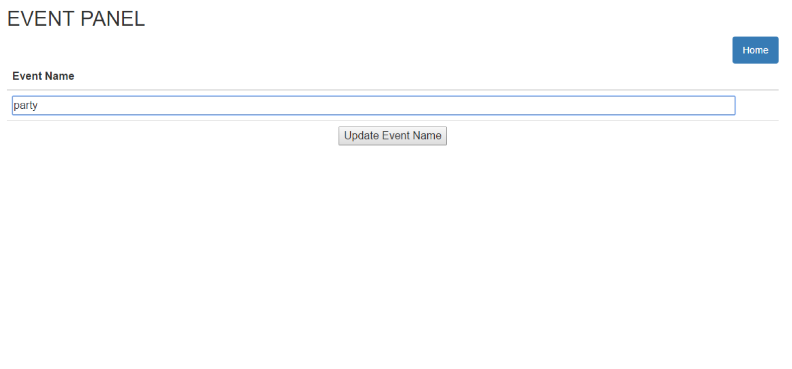

Parts Implemented by Songül Saraç
================================

In order to manage tweets, tags, comments, direct messages and activities as an admin of Unicorn social media web application, all tweets based tables should be initialized by writing itucsdb1601.mybluemix.net/tweets/initialize_tweets on address bar. If tables can be created successfully, the program gives a “Tables inserted” output on page as follow.

After all tables were created, admin user that wants to manage activities such as sending a tweet for a specific user should enter the activities panel page by clicking the “Tweets” button on home page that is seen on Figure xx. ********buraya figure numarasını gir*********** or admin can reach activities panel seen on below image by entering itucsdb1601.mybluemix.net/activities_panel into address bar of the browser. 

On activities panel page, admin user can access tweets, tags, events, comments and direct messages by clicking the buttons of each activity. 

In order to manage tweets of Unicorn users, admin should click “Tweets” button on activities panel page seen on above figure. After that, admin can see all tweet information on itucsdb1601.mybluemix.net/tweets address. The following figure shows this page. On this page, all tweet information are displayed and also delete and update operations can be done by clicking the “Delete” and “Update” on the right side of a tweet.

If a user wants to update tweet for a specific user, he/she clicks the update button what is next to tweet that will be updated and he/she is directed to itucsdb1601.mybluemix.net/tweets/update/<username>/ as it can be seen on below.

The tweet panel after update operation can be seen as below.

Additionally, admin can add a new tweet for a user by entering information. To achieve this, admin can click the “Add a New Tweet” button on the top of tweet panel page. After that, admin can reach the following page and enter username, tweet and tweet category. However, username that will be entered must be on database previously, otherwise, it gives an error message that can be seen below.

Moreover, admin user can manage tags for tweets by clicking “Tags” button on activities panel page and directing to tag panel whose address is itucsdb1601.mybluemix.net/tags as follow. All tag information are represented on this page. Here, there is a “Home” button in order to turn back to home page as it is seen in the following figure

Deletion and updating operations can be done from right side of a tag. After clicking “Update”, admin directs to tag panel page.

After this operation, tag is updated. It can be seen in the following figure.

In order to add a new tag for a tweet, user should click “Add a New Tag” button at right top of above tag panel page. This operation can be proceeded on below page.

Here, tweet input must be included in tweets; otherwise, it gives an error.
All direct messages are displayed on DM panel page. This page can be reached from activities panel by clicking “Direct Messages”

If an admin wants to send a direct messages from one user to another, he/she should enter usernames for sender and receiver that are included in users on database. This page can be accessed by admin by clicking “Send a Direct Message” button on top of DM panel page.

In order to update message, admin should click “Update” that is next to message that is wanted to be updated and he/she directs to following page.

When this update operation will be done successfully by admin, following page will be presented on DM panel.

An admin user can add a new comment by entering username for a user who is contained in users on database, tweet that is included on tweets on database and finally comment by clicking “Add a New Comment” button on Comment panel page.

Comment panel page can be reached from activity panel page by clicking “Comments” button and it displays all comments for all tweets as follow.

In order to update a comment, user can use “Update” link on the right side of comment and he/she directs following page

If a user wants to create a new event, he/she should access the following page from event panel and enter the information about events.

On event panel page, all events are selected and showed. This page can be reached from activities panel by clicking “Activities”. In order to turn back to home page and activities panel pages, there are buttons on right top of comment list.

If a user wants to update event name, following page should be reached by clicking “Update” link from next to comment.

After update operation, event name will be displayed with its new name as below.

