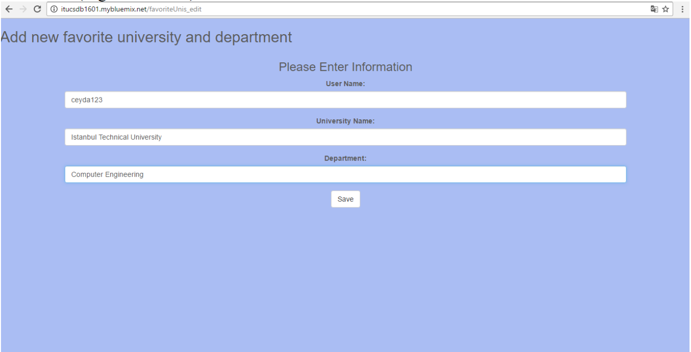
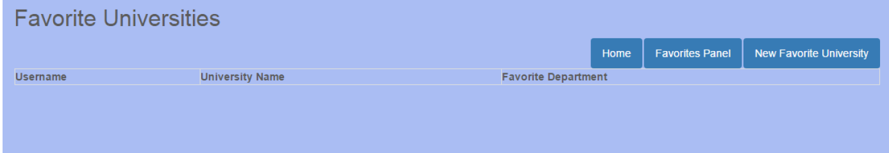

Parts Implemented by Melis Gülenay
================================

The admin pushes the favorites’ page button which is on the home page to manage the user’s favorites. This button connects the admin to the favorites admin panel shown in the figure below. There are five main page that is connected to five buttons on this page. These are favorite users, favorite tags, favorite universities, and favorite events.

In this part, user can add a user as a favorite user. User sees the table consisting of the favorite user relationships.

When the user wants to add a new user favorite, he/she presses the new user favorite button. There are three text boxes in this page. Necessary information which are user login name 1 for the user who are going to add favorite and user login name 2 for the user who are going to be added are filled. If there is not exist such a user, it is not added and the user is warned. Addition to this, there is an inbox for to specify the relation between these two users.

For the delete and update operations, there are two buttons on the right side of the table at the favorite user page.

After the user presses the delete button. The favorite user relationship is deleted.

Update operation is defined on the updating the relation between users. After update button is pressed, update page is opened and user does necessary changes about the relations on this page.

After update operation user can check the new relation value from the favorite user page.

After the favorite universities from favorites admin panel is pressed, user is directed to the favorite university page. User can see the users and their favorite universities and favorite departments on the table

New favorite university button is pressed in order to add new university department. In the opened page user can add a favorite university and favorite department in this university for him/herself.

For the update and delete operations there are two buttons at the right side of the table on favorite university page.

User presses the delete button in order to apply delete operation.

For the update operation, user presses the update button and the page for update operations comes. In this page, user can change the favorite department in chosen university. If user wants to see the result of update operation, he/she checks the favorite universities table. 

When the user presses to the favorite events button from favorites admin panel, he/she is directed to the favorite events page. In this page, events table which shows the favorites event of a user and his/her event status is observed.

If the user wants to add an event and notifies his/her join status, new favorite event button is clicked and the insert operation is done on the opened page.

There are two links that are placed to right side of the table from favorite events page in order to do delete and update operations.

.. figure:: member4/18delupdatebutton.png
	:scale: 50 %
	:alt: delete and update favorite events

The join status of an event can be changed with the update button. After clicking the update button, update page comes to the screen.

Favorite events table before and after update operations is shown below.

Favorite events table before and after delete operations is shown below.

User can specify a popularity of tag and favorite tag. For this purpose, user enters to the favorites page from favorites admin panel. In this page, there is a table which shows the favorite tags and their popularity.

Inserting a new element of the table is done with the new favorite tag page. User enters the user login name, tag, and, popularity. Tag input must be same with the tweet that is belongs to. User can check this value by clicking “check!” link.

Delete and update operations are connected the buttons shown in above figure. User presses the delete button to delete a favorite tag and the update button for updating the popularity. Delete operations is shown below.

For the update operation, user presses to the update button from favorite tags table. In the update operation popularity of a tag is updated.

